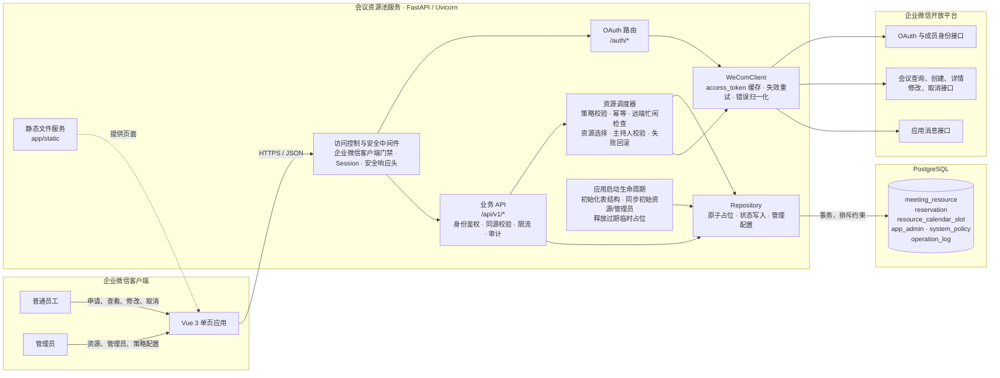
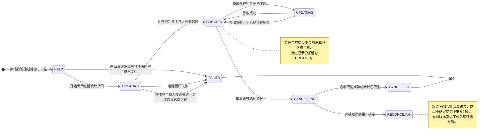
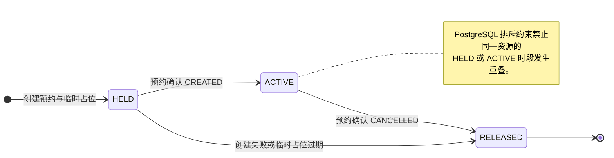
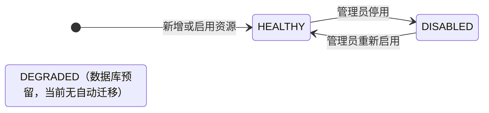

# WeCom Meeting Resource Pool

一个面向企业微信的企业微信高级会议资源池。员工从企业微信工作台进入应用，选择时间和预计时长后，系统自动寻找空闲的高级会议账号创建单次会议，并将申请人设为主持人。

> 使用前请自行核对企业微信开放接口、账号许可和组织内部合规要求。

## 功能

- 企业微信 OAuth 身份识别，不接受前端自行声明 userid
- 多个高级会议账号组成资源池，按优先级自动调度
- 查询资源账号已有会议，避免重复占用
- PostgreSQL 原子占位和排斥约束，防止并发超卖
- 创建单次会议并将申请人指定为主持人
- 返回会议 ID、会议号、密码和入会链接
- 查看本人会议、修改主题、取消未开始会议
- 管理后台维护高级资源、管理员和预约策略
- 幂等请求、同源校验、限流、安全响应头和操作审计
- 可选的企业微信客户端 User-Agent 门禁

当前不支持周期会议、固定会议号和普通会议降级。

## 技术栈

- Python 3.10+
- FastAPI / Uvicorn
- PostgreSQL 14+
- Vue 3 / TypeScript / Vite

## 服务架构



核心数据流为：工作台身份进入 → 服务端 OAuth 确认 `userid` → 校验预约策略 →
逐个检查高级资源的远端会议 → PostgreSQL 原子占位 → 创建会议并校验申请人为主持人 →
确认占位并返回会议号、密码和入会链接。管理员配置直接存储在数据库中，修改后即时生效。

## 快速开始

### 1. 创建数据库

```bash
createdb wecom_meeting_pool
```

应用启动时会自动执行 `app/schema.sql`。

### 2. 配置后端

```bash
python -m venv .venv
source .venv/bin/activate
pip install -e ".[test]"
cp .env.example .env
```

Windows PowerShell 激活命令：

```powershell
.\.venv\Scripts\Activate.ps1
```

编辑 `.env`，至少填写：

- `APP_BASE_URL`：自建应用的可信访问地址
- `SESSION_SECRET`：至少 32 个随机字符
- `DATABASE_URL`：PostgreSQL 连接串
- `WECOM_CORP_ID`：企业 CorpID
- `WECOM_APP_SECRET`：自建应用 Secret
- `WECOM_AGENT_ID`：自建应用 AgentId
- `WECOM_MEETING_RESOURCE_USERIDS`：持有高级会议权限的 userid，逗号分隔
- `WECOM_ADMIN_USERIDS`：首次启动时引导的管理员 userid

生产环境建议把 Secret 放入权限受控的独立环境文件或 Secret Manager，不要提交到 Git。

本仓库只包含会议资源池核心应用，不包含反向代理、TLS 证书、域名认证文件或其他
特定服务器的基础设施配置。

### 3. 构建前端

```bash
cd frontend
pnpm install
pnpm test
pnpm build
cd ..
```

Vite 会把生产文件输出到 `app/static`。

### 4. 启动

```bash
uvicorn app.main:app --host 127.0.0.1 --port 8001
```

健康检查：

```bash
curl http://127.0.0.1:8001/health
```

## 企业微信配置

1. 创建企业微信自建应用并设置应用主页。
2. 将 `APP_BASE_URL` 对应域名配置为可信域名；按企业微信后台提示下载认证文件，并由
   实际托管环境将该文件发布到域名根路径。认证文件可能包含组织专属校验值，不要提交
   到公开仓库。
3. 为应用配置可见范围。
4. 按企业微信后台要求开通通讯录成员读取以及会议创建、查询、修改、取消等接口权限。
5. 将高级会议许可持有人的 userid 加入资源池。

不同企业微信版本和许可下可用接口可能不同，请以企业微信管理后台和官方接口响应为准。

## 服务状态转移

### 预约状态



`FAILED` 和 `CANCELLED` 是终止状态；`RECONCILING` 表示远端结果不确定，并非取消成功。
幂等键命中已有预约时直接返回原记录，不创建新的状态实例。

### 资源时段占位状态



预约与资源占位在同一业务流程中联动：预约 `HELD → CREATING → CREATED` 对应资源占位
`HELD → ACTIVE`；创建失败对应资源占位 `HELD → RELEASED`；取消结果不确定时预约进入
`RECONCILING`，资源占位保持 `ACTIVE`。

### 高级资源可用状态



## 测试

```bash
pytest -q

cd frontend
pnpm test
pnpm build
```

生产接口联调脚本位于 `tools/`。运行端到端脚本会真实创建并立即取消一场测试会议，
请仅在隔离时段和明确授权下使用。

## 安全说明

- `.env*` 默认被忽略，仅 `.env.example` 可以提交。
- OAuth 会话使用服务端签名 Cookie；生产环境应使用 HTTPS。
- 管理员权限从数据库即时读取，并强制至少保留一名管理员。
- 资源只停用、不物理删除，以保留历史预约和审计记录。
- `REQUIRE_WECOM_CLIENT=true` 会拒绝不含 `wxwork` 标识的请求，但 User-Agent 可伪造，
  不能代替 OAuth 和权限校验。

详见 [SECURITY.md](SECURITY.md)。

## License

[MIT](LICENSE)
